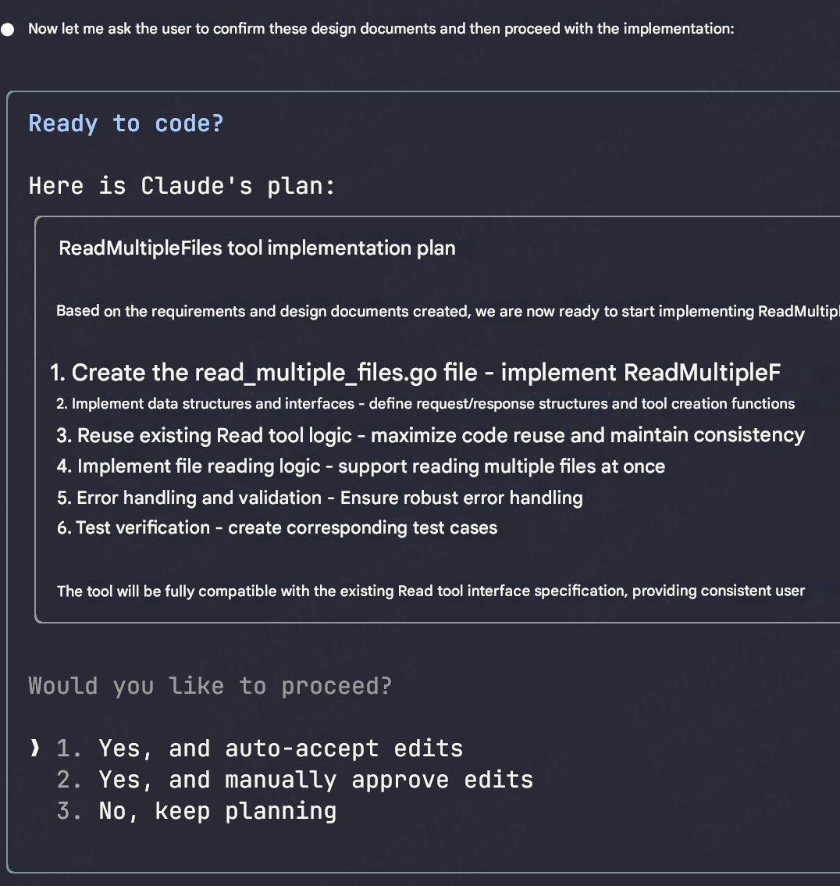

# Kiro Spec In Claude Code

## Background

During the height of Vibe Coding, Kiro brought the Spec development approach into the IDE. This makes Vibe Coding much easier for everyone.
Kiro works like a technical manager, collaborating with you to clarify requirements, design solutions, and plan tasks. This approach aligns requirements with AI as much as possible and ensures accurate context is provided to AI. It's also an implementation of Context Engineering.

> Experienced developers should be familiar with this process and approach. Everyone's form or method may be inconsistent. The benefit of Kiro is that it integrates this process into the IDE, allowing even those who don't know how to code to participate in Vibe Coding :)

## Kiro Spec

### The Three Stages of Spec

Each Spec directory contains 3 files representing three stages:

1️⃣ requirements.md

- Requirements document
- User stories and acceptance criteria
- Written using the [EARS](https://translate.google.com/translate?hl=en&sl=zh-CN&u=https://visuresolutions.com/zh-CN/%E7%94%9F%E6%B4%BB%E6%8C%87%E5%8D%97/%E9%87%87%E7%94%A8%E8%80%B3%E6%9C%B5%E7%AC%A6%E5%8F%B7/&prev=search) standard

2️⃣ design.md

- Architecture document
- Records technical architecture
- Sequence diagrams and implementation considerations

3️⃣ tasks.md

- Task list
- Provides specific todo list
- Facilitates project progress tracking

## Claude Code Spec

Claude Code supports [Custom Command](https://docs.anthropic.com/en/docs/claude-code/common-workflows#create-custom-slash-commands), so we can define a `spec` command for the Spec portion of Kiro's System Prompt, thereby implementing the Spec workflow in Claude Code.

So, how do we implement Kiro In Claude Code? We divide it into three steps:

1. Obtain [Kiro System Prompt](./kiro-system-prompt.md)
2. Customize [Spec Prompt](./spec.md)
3. Implement Spec Command `mv spec.md ~/.claude/commands/spec.md`

## Results

### Requirements

Use the `/spec` command to discuss requirements with Claude Code:


### Design


### Tasks

Note: The Task section has been removed from spec.md because Claude Code implements its own Task section. It excels at managing tasks with Todo lists.



The corresponding Spec files will be generated in the project's `.claude` directory. For example:

```
❯ tree .claude/specs
.claude/specs
├── read-multiple-files-tool
│   ├── design.md
│   └── requirements.md
```