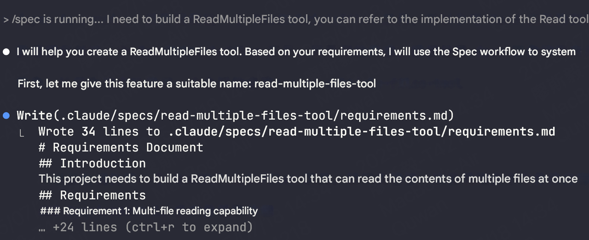
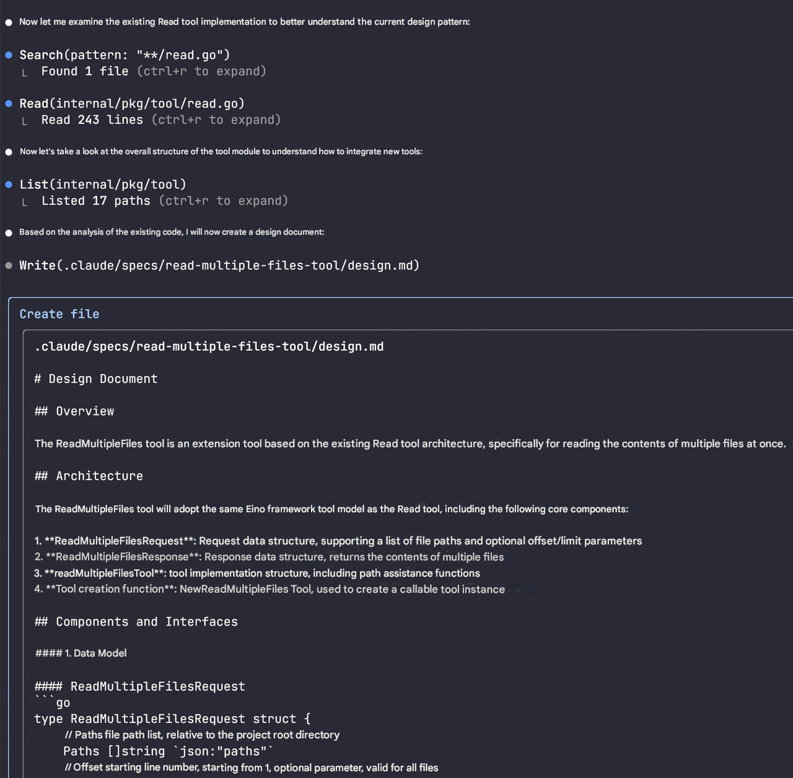

# Kiro Spec In Claude Code

## 背景

在 Vibe Coding 如火如荼的期间，Kiro 将 Spec 这种开发方式带入了 IDE 中。让大家能够更加容易进行 Vibe Coding。
Kiro 用起来就像是一个技术经理，它和你一起梳理需求（Requirements）、设计方案（Design）、制定计划（Task）。以这种方式，尽可能与 AI 对齐需求，尽可能保证提供给 AI 准确的 Context。也是 Context Enginerring 的一种实现方式。

> 有经验的开发者应该都知道应该这个流程和方式，大家的形式或者说方法可能是不一致的。Krio 的好处是：它将这个流程内置到了 IDE 中，让更多不会开发的人也可以 Vibe Coding :)

## Kiro Spec

### Spec 的三个阶段

每一个 Spec 目录下都包含 3 个文件，代表三个阶段：

1️⃣ requirements.md

- 需求文档
- 用户故事和验收标准
- 采用[EARS](https://visuresolutions.com/zh-CN/%E7%94%9F%E6%B4%BB%E6%8C%87%E5%8D%97/%E9%87%87%E7%94%A8%E8%80%B3%E6%9C%B5%E7%AC%A6%E5%8F%B7/) 规范编写

2️⃣ design.md

- 架构文档
- 记录技术架构
- 序列图和实施注意事项

3️⃣ tasks.md

- 任务清单
- 提供具体的 todolist
- 便于跟踪项目进度

## Claude Code Spec

Claude Code 支持 [Custom Command](https://docs.anthropic.com/en/docs/claude-code/common-workflows#create-custom-slash-commands) ，那么就可以将 Kiro 的 System Prompt 中 Spec 的部分定义一个 `spec` 命令，以此在 Claude Code 中实现 Spec 的流程。

那么，如何实现 Kiro In Claude Code 呢？我们拢共分为三步：

1. 获取 [Kiro System Prompt](./kiro-system-prompt.md)
2. 定制 [Spec Prompt](./spec.md)
3. 实现 Spec Command `mv spec.md ~/.claude/commands/spec.md`

## 效果

### Requirements

使用 `/spec` 命令和 Claude Code 聊需求：



### Design



### Tasks

说明：在 spec.md 中去掉了 Task 部分，因为 Claude Code 自己实现了 Task 的部分，它擅长用 Todo 来管理任务。


Spec 对应的文件会在项目的 `.claude` 目录下生成。例如：

```
❯ tree .claude/specs
.claude/specs
├── read-multiple-files-tool
│   ├── design.md
│   └── requirements.md
```
